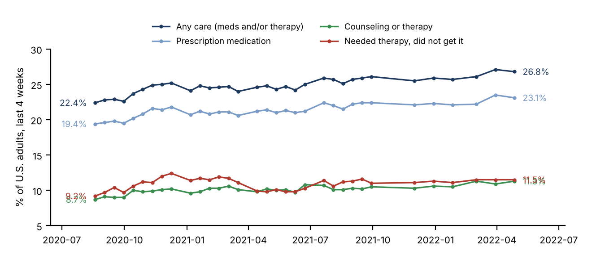
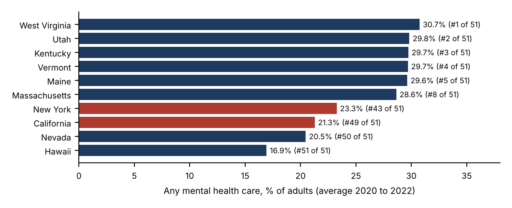
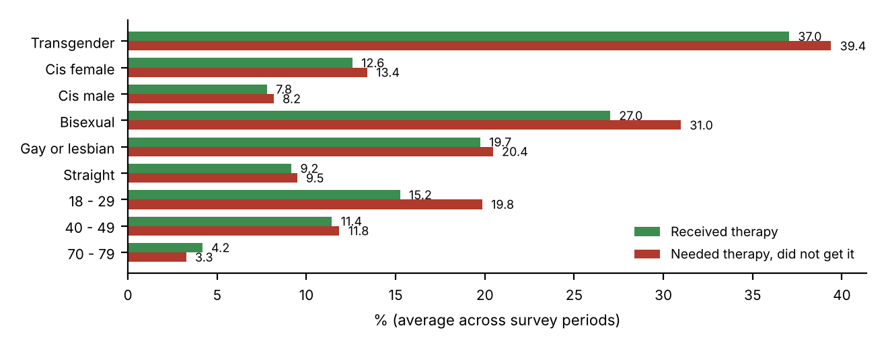

# Mental Health Care Use During COVID-19

An analysis of how U.S. adults used mental health care during the pandemic, and who was left without the care they needed. It uses CDC Household Pulse Survey data, analyzed in R and SQL.

**Author:** Erica Mathias

## Questions

1. How did mental health care use change from 2020 to 2022?
2. Which groups used the most care, and which had the most unmet need?
3. How does care use vary across states?

## Key findings

- **Care use rose steadily.** The share of adults who took medication or received therapy grew from **22.4% (Aug 2020) to 26.8% (Apr 2022)**.
- **Unmet need grew too.** Adults who needed therapy but did not get it rose from **9.2% to 11.5%**, roughly 1 in 9 adults.
- **Big gender gap.** Women used care far more often than men (**30.7% vs 18.5%**).
- **Highest use and highest unmet need in the same group.** Transgender adults had the highest care use (**54.5%**) and also the highest unmet need (**39.4%**), so demand far outpaced access.
- **Unmet need by sexual orientation.** Bisexual adults (31.0%) and gay or lesbian adults (20.4%) reported much more unmet need than straight adults (9.5%).
- **State leaders.** West Virginia, Utah and Kentucky had the highest care use. Hawaii, Nevada and California had the lowest.
- **Data precision.** Smaller subgroups have wider confidence intervals (r = 0.43 between estimate and interval width), so their results were read with more caution.





## Data

`Mental_Health_Care_in_the_Last_4_Weeks.csv`: CDC / U.S. Census Bureau Household Pulse Survey, 2020 to 2022. It reports four indicators (medication, therapy, either, and unmet need) by age, sex, gender identity, sexual orientation, race and ethnicity, education, disability, symptoms and state. Each row is a published percentage estimate with a 95% confidence interval.

## Files

| File | Purpose |
|---|---|
| `key_findings.R` | Reproduces every number above, comparing results within each indicator |
| `projectAIT.R` | Exploratory analysis: trends, subgroup boxplots, and a static plus interactive (plotly) state map |
| `pro.sql` | MySQL schema, data load, and summary queries |
| `figures/` | Charts used in the findings |

## Tools

R (dplyr, tidyr, ggplot2, maps, plotly), MySQL

## Run it

```r
install.packages(c("dplyr", "tidyr", "ggplot2", "maps", "mapdata", "plotly"))
source("key_findings.R")
```
